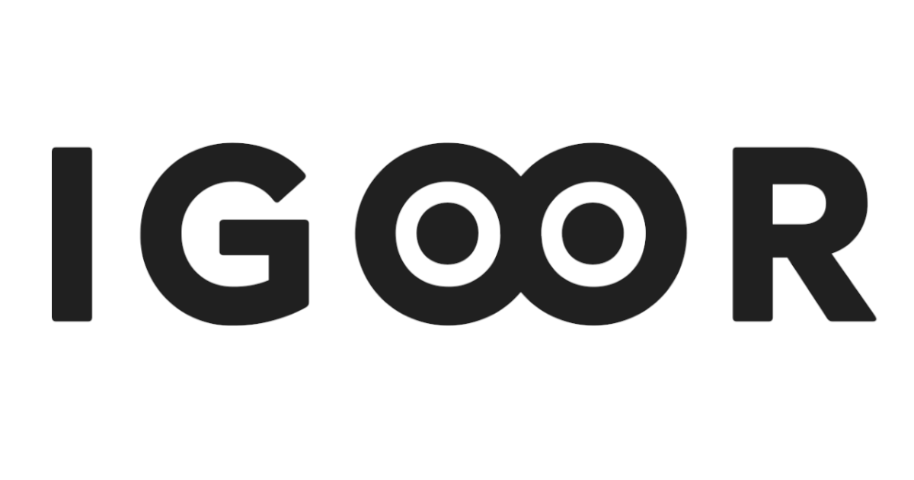

# IGOOR

IGOOR is an open-source and free conversational application, controllable by eye-tracking, designed to provide people with neurodegenerative diseases or paralysis a smooth and natural means of communication.

Take a look at the [IGOOR website](https://igoor.org/en) for further infos about our core principles, values and software roadmap.

## Notice of Development, Confidentiality, and Contribution Terms

**This project is currently under private development. While the final version of the software WILL BE released as free/libre under the GPLv3 License, the current codebase is not yet public and is subject to strict confidentiality.**

IGOOR is written by Carlo Giordano, based on a concept by Igor Novitzki.
UX/UI by Zenoid.

All collaborators and contributors are reminded that:

1. Sharing Prohibited: The code, documentation, and any associated materials must not be shared, distributed, or disclosed to anyone outside of the development team without prior written permission.
2. Access Restriction: Access to this repository is granted solely for the purpose of contributing to the project's private development phase.
3. Contribution Licensing: By contributing to this project, you agree that all contributions you make will be licensed under the GPLv3 License upon the software's public release.

Failure to comply with these terms may result in immediate removal from the project and other appropriate actions.

Thank you for your understanding and cooperation in ensuring the successful development of this software.

## REQUIREMENTS

### OS 

**Microsoft Windows. Tested on Windows 10 and 11.**

### Microsoft © Edge WebView2 Runtime

This application currently uses Microsoft Edge WebView2 Runtime to display a browser-like window.

You can download it here:

https://developer.microsoft.com/en-us/microsoft-edge/webview2?form=MA13LH#download

NOTE: IGOOR installers sistematically include the runtime.
Microsoft Edge WebView2 Runtime is © Microsoft Corporation.

### INTERNET CONNECTION

While we are working on a fully local, offline-first version, as of now the software only works with a working Internet connection.

### AI INFERENCE PROVIDER

The only AI inference provider currently meeting our requirements of speed, privacy, quality and support of opensource models is Groq.
Signup for a FREE-tier access to Groq's API here:

https://console.groq.com/login

For production use, you will need a developer tier self-serve (Pay per Token) access, 
or you'll rapidly incur in rate limits errors.

### DISK SPACE

In the user's data folder, big ASR models (like Vosk) take around 2.3Gb, plus 1.4 for the zip file.

The embedding model from HuggingFace currently requires 1.15Gb on disk.

The app should take less than 3Gb.

### FFMPEG

As of now, TTS plugin for Speechify requires ffmpeg, and that the path to ffmpeg\bin folder be included in the system PATH environment variable.

NOTE: Complete IGOOR installers include ffmpeg and automatically set the env variable.


### PYTHON

See requirements.txt for a list of Python libraries needed.

## INSTALLATION

### PYTHON VERSION

Currently tested on **Python 3.10.6**. Download it from here: 

[PYTHON]https://www.python.org/downloads/release/python-3106/

### UPGRADE PIP
```
python -m pip install --upgrade pip
```

### SETUP VIRTUAL ENVIRONMENT
```
python -m venv venv
venv\scripts\activate
```

### INSTALL LIBRARIES
```
pip install -r requirements.txt
```

### ENV
Rename environment variables:

```
rename .env-example .env
```


## USER'S DATA FOLDER

User's data folder is automatically created inside userAppDataFolder (on Windows is usually C:/Users/YourUsername/AppData/).
The application folder (IGOOR_FOLDER) on Win is :

```
C:/Users/YourUsername/AppData/Roaming/igoor/
```

The folder contains a settings.json and a plugins data folder, called "plugins".

### NOTES ABOUT PLUGINS

Plugins are currently de/activated by using settings.

#### AUTOMATIC SPEECH RECOGNITION WITH VOSK

Vosk is a local ASR (Automatic Speech Recognition) plugin.
It automatically downloads a model from this page in the user's language (default "fr"): 

https://alphacephei.com/vosk/models

And places it in 

IGOOR_FOLDER/plugins/asrvosk/models/language/model_size

Language and model size are set in the global settings file, example:

```
other plugins...
"asrvosk": {
    "lang": "fr_FR",
    "wakeword": "Igor",
    "model_size": "small",
    "continuous": false,
    "min_confidence": 0.7
}
...other plugins
```

In this case the final path is :

IGOOR_FOLDER/plugins/asrvosk/models/language/model_size

NOTE: Because of its high WER compared to Whisper and Voxtral, we recommend using Vosk only if audio privacy is paramount.

### Static Knowledge Base from patient documents (RAG, RetrievalAugmentedGeneration)

Documents in IGOOR_FOLDER/plugins/rag/medias/ are scanned by the RAG plugin.

Allowed formats:
.pdf
.txt
.md

If the index folder (IGOOR_FOLDER/plugins/rag/faiss_index) does not exist, but the medias folder do exist and it's not empty, at startup the plugin will create or update the index by ingesting all the (new) documents in the medias folder.

### EMBEDDING MODELS FOR RAG

Embedding models for RAG are downloaded automatically in their folders.
On Win, this is at:

```
C:\Users\YourUsername\.cache\huggingface\hub
```

## LAUNCH

```
python main.py
```

This launches in a resizable window, with the browser's debug console opened and the python CLI visible.

Use:

```
igoor.bat
```

to open a on-top window, without debug console (CLI window will open and then disappear in the system bar).

## CREATE AN EXECUTABLE

### REQUIREMENTS 

First of all, upgrade pyinstaller: 

```
pip install --upgrade pyinstaller
```

and hooks-contrib

```
pip install --upgrade pyinstaller-hooks-contrib
```

### WEBRTCVAD-WHEELS

Modify the hook in the virtual environment folder:

\venv\lib\site-packages\_pyinstaller_hooks_contrib\stdhooks\hook-webrtcvad.py

Replace code with this code:
```
from PyInstaller.utils.hooks import copy_metadata

datas = copy_metadata('webrtcvad-wheels')
```

### CREATE THE EXECUTABLE

In powershell (VS Code terminal):

```
venv\scripts\Activate
.\create_exe.bat
```

This takes around 8/10 minutes.
Or you can do the fast version without cleaning all dirs:

```
venv\scripts\Activate
.\create_exe_fast.bat
```

This takes around 5/7 minutes.

In a CMD window, launch /dist/igoor/igoor.exe 
(so you can see the logs if there's any error)


## IGOOR LOGS
Daily logs are in:

```
IGOOR_FOLDER/logs/
```

Separate llm_invocations contain a JSON of all LLM calls, with prompt/answer and reasoning (where applicable)

## ADDING A LANGUAGE

### REQUIREMENTS
For each plugin, check if the language is supported. Start by Vosk and Whisper models.
For each LLM, check if the language is supported too.
For TTS, check if the external model supports the language (Eleven Labs, Speechify etc.)

### PLUGINS

### WHISPER
Whisper and Voxtral models have a known bug that can convert silences or very low, inaudible sounds, to specific strings never uttered by the user (ex. "Sous-titrage ST' 501"). These are cleaned by the function "clean_whisper_silence" in plugins/asrwhisper.py (added in 0.1.3.5). 
New languages may require new filters to be applied.

## KNOWN ISSUES ##
1) ASR models can interpret silence or very low, inaudible sounds as speech and return texts like "Thank you" instead of empty texts. This depends on the ASR models, not the IGOOR app.